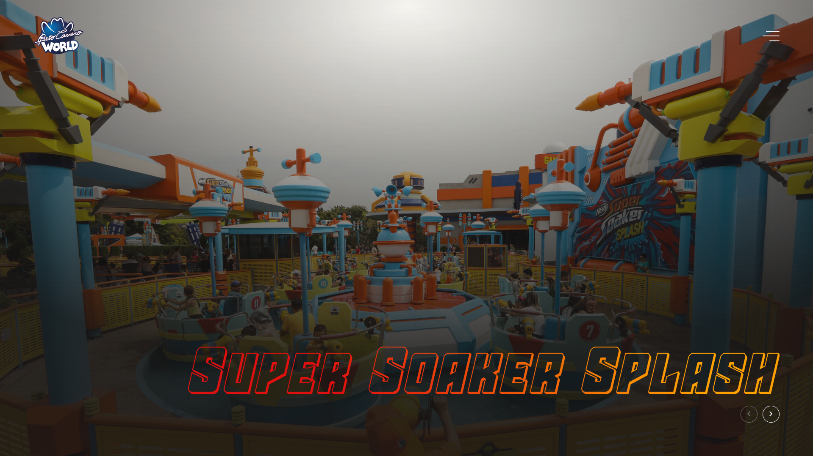

# Projeto - Principais Atrações Beto Carrero

## 🚀 Tecnologias usadas no projeto
- JavaScript
- HTML
- CSS

## 📚 Conhecimentos abordados
- [x] Uso semântico do HTML
- [x] Uso do CSS Flexbox
- [x] Carrocel de imagens
- [x] Menu lateral
- [x] Carregamento de fonte externa
- [x] Uso de cores gradientes no texto

## Link
[https://atracoes-beto-carrero.netlify.app/](https://atracoes-beto-carrero.netlify.app/)

